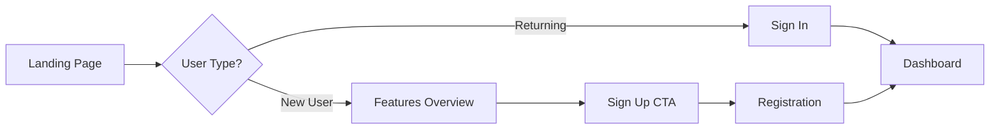
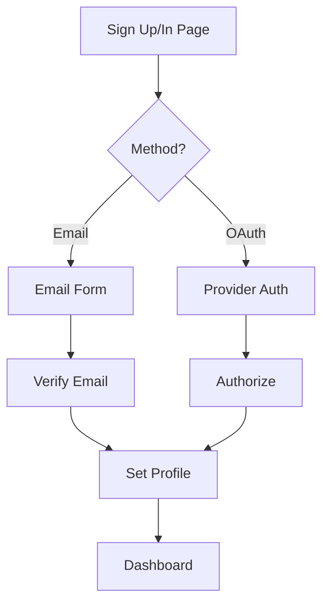
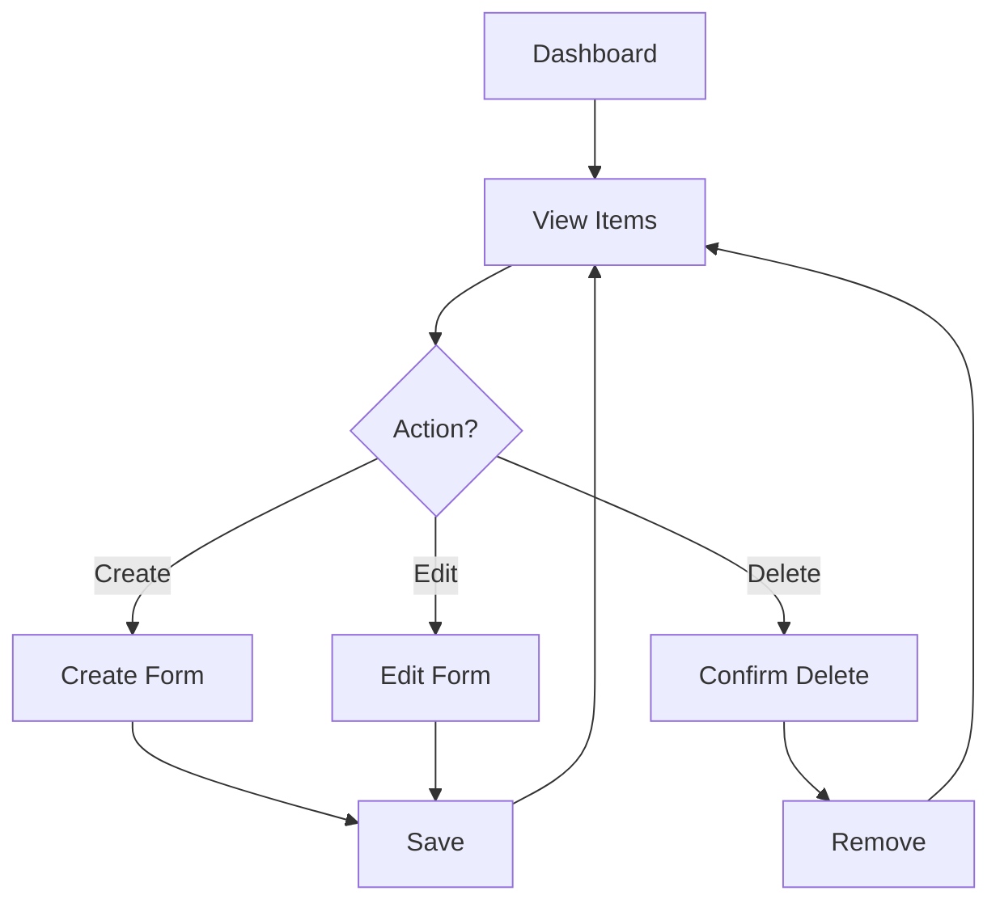
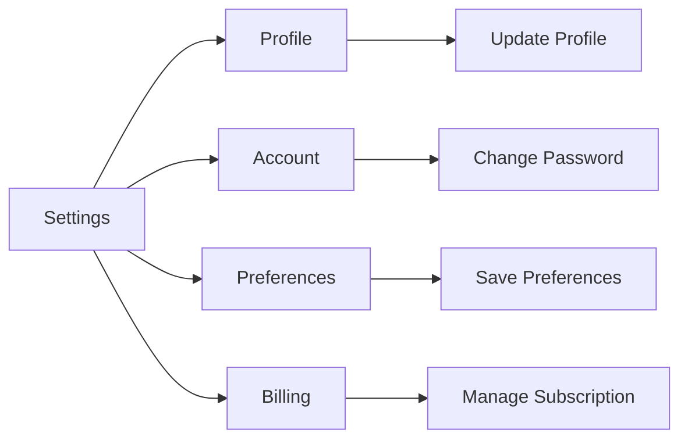

# User Flow Template

## Overview
This document maps all user journeys through the application, from initial landing to goal completion.

## Primary User Flows

### 1. Landing & Discovery Flow

**Key Pages:**
- `/` - Landing page
- `/features` - Feature showcase
- `/pricing` - Pricing tiers
- `/about` - Company/product info

**User Actions:**
- Browse features
- View pricing
- Watch demo
- Start free trial

### 2. Authentication Flow

**Key Pages:**
- `/auth/signin` - Sign in
- `/auth/signup` - Registration
- `/auth/verify` - Email verification
- `/auth/forgot` - Password reset
- `/onboarding` - Initial setup

**Edge Cases:**
- Invalid credentials → Error message + retry
- Email not verified → Resend verification
- OAuth failure → Fallback to email
- Session expired → Redirect to sign in

### 3. Core Application Flow

**Key Pages:**
- `/dashboard` - Main dashboard
- `/[resource]` - List view
- `/[resource]/new` - Create form
- `/[resource]/[id]` - Detail view
- `/[resource]/[id]/edit` - Edit form

**User Actions:**
- Create new items
- View item details
- Edit existing items
- Delete items
- Filter/sort lists
- Search content

### 4. Settings & Profile Flow

**Key Pages:**
- `/settings` - Settings hub
- `/settings/profile` - Profile management
- `/settings/account` - Account security
- `/settings/billing` - Subscription management
- `/settings/team` - Team management (if applicable)

### 5. Error & Recovery Flows

**404 - Not Found:**
- Show friendly 404 page
- Suggest similar pages
- Provide search
- Link to homepage

**500 - Server Error:**
- Display error boundary
- Log error details
- Show user-friendly message
- Provide support contact

**Offline State:**
- Show offline indicator
- Cache critical data
- Queue actions for sync
- Auto-retry when online

## User Personas & Their Journeys

### Persona 1: [New User]
**Goal:** Understand product value and sign up
**Journey:**
1. Lands on homepage
2. Explores features
3. Watches demo video
4. Checks pricing
5. Signs up for free trial
6. Completes onboarding
7. Creates first item

### Persona 2: [Power User]
**Goal:** Efficiently manage multiple items
**Journey:**
1. Signs in (remembered)
2. Goes directly to dashboard
3. Uses keyboard shortcuts
4. Bulk actions on items
5. Exports data
6. Configures automations

### Persona 3: [Admin User]
**Goal:** Manage team and settings
**Journey:**
1. Signs in with SSO
2. Reviews team dashboard
3. Invites new members
4. Sets permissions
5. Reviews usage analytics
6. Updates billing

## Navigation Structure

### Primary Navigation
- Logo → Homepage
- Dashboard (authenticated)
- [Main Features]
- Settings
- Profile Menu

### Secondary Navigation
- Footer links
- Breadcrumbs
- Related actions
- Quick actions menu

### Mobile Navigation
- Hamburger menu
- Bottom tab bar (core actions)
- Swipe gestures
- Pull to refresh

## State Transitions

### Loading States
- Initial page load → Skeleton screens
- Data fetching → Loading spinners
- Form submission → Button loading state
- Background sync → Progress indicators

### Success States
- Form saved → Success toast
- Action completed → Confirmation message
- Goal achieved → Celebration animation

### Error States
- Validation error → Inline field errors
- API error → Error toast with retry
- Permission denied → Access denied page
- Rate limited → Wait message with timer

## Accessibility Flows

### Keyboard Navigation
- Tab through all interactive elements
- Enter/Space to activate
- Escape to close modals
- Arrow keys for menus

### Screen Reader
- Proper heading hierarchy
- ARIA labels on buttons
- Form field descriptions
- Status announcements

### Reduced Motion
- Disable animations
- Instant transitions
- Static loading states

## Metrics & Analytics Events

### Key Events to Track
- Sign up started/completed
- Feature discovered/used
- Item created/edited/deleted
- Errors encountered
- Time to first action
- Session duration
- Retention checkpoints

### Conversion Funnels
1. Landing → Sign Up (conversion rate)
2. Sign Up → First Action (activation rate)
3. Trial → Paid (conversion rate)
4. Daily → Weekly Active (retention rate)